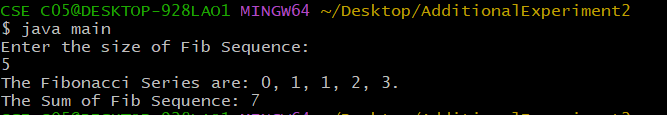

## AdditionalExperiment-2
# Title: To Find The Sum of First n Fibonacci Numbers.
# Source Code:
```java
class Fibonacci {
  int firstNumber;
  int secondNumber;
  int thirdNumber;
  int sum;
  int sizeOfFibSequence;
  Fibonacci(int size) {
    firstNumber = 0;
    secondNumber = 1;
    thirdNumber = 0;
    sum = 0;
    sizeOfFibSequence = size;
  }
  void generateFibSequence() {
    while(sizeOfFibSequence > 0) {
      if(sizeOfFibSequence == 1) {
        System.out.println(firstNumber + ".");
      }
      else {
        System.out.print(firstNumber + ",");
      }
      sizeOfFibSequence--;
      sum+=firstNumber;
      thirdNumber = firstNumber + secondNumber;
      firstNumber = secondNumber;
      secondNumber = thirdNumber;
    }
  }
  int getFibSum() {
    return sum;
  }
}
import java.util.Scanner;
class main {
  public static void main(String[] args) {
    System.out.println("Enter the size of Fib Sequence: ");
    Scanner sc = new Scanner(System.in);
    int size = sc.nextInt();
    if(size > 0) {
      Fibonacci fib = new Fibonacci(size);
      System.out.print("The Fibonacci Series are: ");
      fib.generateFibSequence();
      System.out.print("The Sum of Fib Sequence: " + fib.getFibSum());
    }
    else {
      System.out.println("The Fibonacci Series and Sum cannot be calculated.");
    }
  }
}
```

# Output:

