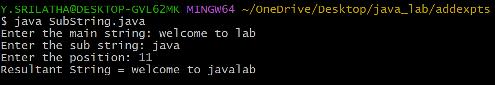
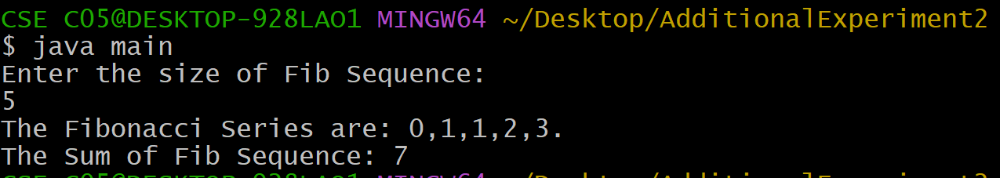
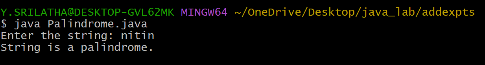
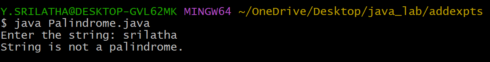
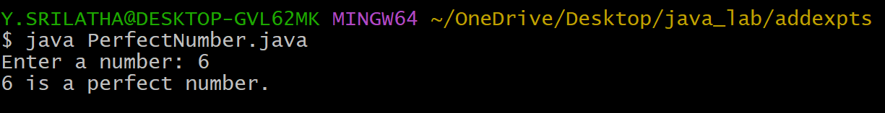
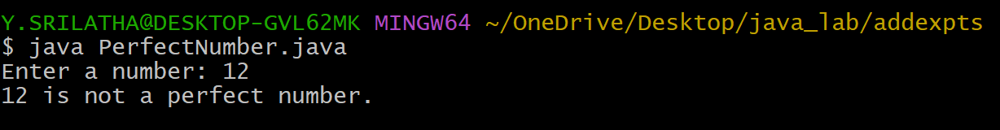

## ADDITIONAL EXPERIMENT-1 :
# TITLE : INSERTION OF SUBSTRING INTO MAINSTRING
# SOURCE CODE :
```java
import java.util.Scanner;

class SubStringInsert {
    public static void main(String[] args) {

        String mainString, subString;
        int position;

        Scanner sc = new Scanner(System.in);


        System.out.print("Enter the main string: ");
        mainString = sc.nextLine();


        System.out.print("Enter the sub string: ");
        subString = sc.nextLine();


        System.out.print("Enter the position: ");
        position = sc.nextInt();

        int length = mainString.length();
        String resultString;


        if (position >= 0 && position <= length) {

            String firstPart = mainString.substring(0, position);
            String secondPart = mainString.substring(position);

            resultString = firstPart + subString + secondPart;

            System.out.println("Resultant String = " + resultString);
        }
        else {
            System.out.println("Substring is not possible to insert");
            System.out.println("Condition: 0 <= position <= length of main string");
        }

        sc.close();
    }
}
```
# OUTPUT :



## AdditionalExperiment-2
# Title: To Find The Sum of First n Fibonacci Numbers.
# Source Code:
```java
class Fibonacci {
  int firstNumber;
  int secondNumber;
  int thirdNumber;
  int sum;
  int sizeOfFibSequence;
  Fibonacci(int size) {
    firstNumber = 0;
    secondNumber = 1;
    thirdNumber = 0;
    sum = 0;
    sizeOfFibSequence = size;
  }
  void generateFibSequence() {
    while(sizeOfFibSequence > 0) {
      if(sizeOfFibSequence == 1) {
        System.out.println(firstNumber + ".");
      }
      else {
        System.out.print(firstNumber + ",");
      }
      sizeOfFibSequence--;
      sum+=firstNumber;
      thirdNumber = firstNumber + secondNumber;
      firstNumber = secondNumber;
      secondNumber = thirdNumber;
    }
  }
  int getFibSum() {
    return sum;
  }
}
import java.util.Scanner;
class main {
  public static void main(String[] args) {
    System.out.println("Enter the size of Fib Sequence: ");
    Scanner sc = new Scanner(System.in);
    int size = sc.nextInt();
    if(size > 0) {
      Fibonacci fib = new Fibonacci(size);
      System.out.print("The Fibonacci Series are: ");
      fib.generateFibSequence();
      System.out.print("The Sum of Fib Sequence: " + fib.getFibSum());
    }
    else {
      System.out.println("The Fibonacci Series and Sum cannot be calculated.");
    }
  }
}
```

# Output:


## ADDITIONAL EXPERIMENT-3 :
# TITLE : DETERMINE A STRING IS A PALINDROME
# SOURCE CODE :
```java
import java.util.Scanner;

class Palindrome {
    public static void main(String[] args) {

        String str;
        Scanner sc = new Scanner(System.in);


        System.out.print("Enter the string: ");
        str = sc.nextLine();

        int start = 0;
        int end = str.length() - 1;
        boolean flag = true;


        while (start < end) {
            if (str.charAt(start) != str.charAt(end)) {
                System.out.println("String is not a palindrome.");
                flag = false;
                break;
            }
            start++;
            end--;
        }

        if (flag) {
            System.out.println("String is a palindrome.");
        }

        sc.close();
    }
}
```
# OUTPUT :




## ADDITIONAL EXPERIMENT-4 :
# TITLE : CHECK WHETHER NUMBER IS PERFECT OR NOT
# SOURCE CODE :
```java
import java.util.Scanner;
class PerfectNumber {
    public static void main(String[] args) {
        int num, sum = 0;

        Scanner sc = new Scanner(System.in);


        System.out.print("Enter a number: ");
        num = sc.nextInt();


        for (int i = 1; i < num; i++) {
            if (num % i == 0) {
                sum = sum + i;
            }
        }


        if (sum == num) {
            System.out.println(num + " is a perfect number.");
        } else {
            System.out.println(num + " is not a perfect number.");
        }

        sc.close();
    }
}
```
# OUTPUT :


