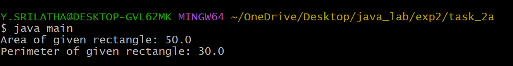
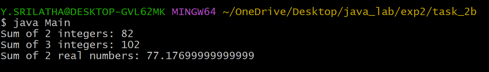
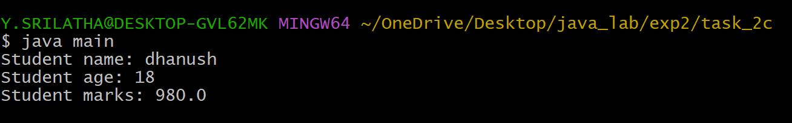

# EXPERIMENT-2:
## 2a) Title: Find Area and Perimetre of given Rectangle
## Source Code:
```java
class Rectangle {
  double length;
  double breadth;
  double area() {
    return length*breadth;
  }
  double perimeter() {
    return 2*(length + breadth);
  }
}
class main {
  public static void main(String[] args) {
    Rectangle rect = new Rectangle();
    rect.length = 10;
    rect.breadth = 5;
    double area = rect.area();
    double perimeter = rect.perimeter();
    System.out.println("Area of given rectangle: " + area);
    System.out.println("Perimeter of given rectangle: " + perimeter);
  }
}
```
## Output:


## 2b) Title: To implement method overloading
## Source Code:
```java
class sum {
  int sum(int a, int b) {
    return a + b;
  }
  int sum(int a, int b, int c) {
    return a + b + c;
  }
  double sum(double a, double b) {
    return a + b;
  }
}class Main {
  public static void main(String[] args) {
    sum s = new sum();
    System.out.println("Sum of 2 integers: " + s.sum(36,46));
    System.out.println("Sum of 3 integers: " + s.sum(20,36,46));
    System.out.println("Sum of 2 real numbers: " + s.sum(30.456,46.721));
  }
}
```
## Output:


## 2c) Title: To implement Constructor
## Source Code:
```java
class student {
  String sname;
  int sage;
  double smarks;
  student(String name, int age, double marks) {
    sname = name;
    sage = age;
    smarks = marks;
  }
  void display() {
    System.out.println("Student name: " + sname);
    System.out.println("Student age: " + sage);
    System.out.println("Student marks: " + smarks);
  }
}
class main {
  public static void main(String[] args) {
    student s = new student("dhanush",18,980);
    s.display();
  }
}
```
## Output:

