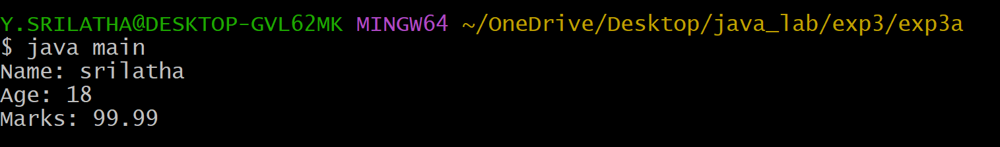

## EXPERIMENT-3:
# 3A)TITLE: TO IMPLEMENT CONSTRUCTOR OVERLOADING IN JAVA.
# SOURCE CODE:
```java
class Student {
  String name;
  int age;
  double marks;
  Student(String name, int age, double marks) {
    this.name = name;
    this.age = age;
    this.marks = marks;
  }
  void display() {
    System.out.println("Name: " + name);
    System.out.println("Age: " + age);
    System.out.println("Marks: " + marks);
  }
}
class main {
  public static void main(String args[]) {
    Student s1 = new Student("srilatha",18,99.99);
    s1.display();
  }
}

```
# OUTPUT:

