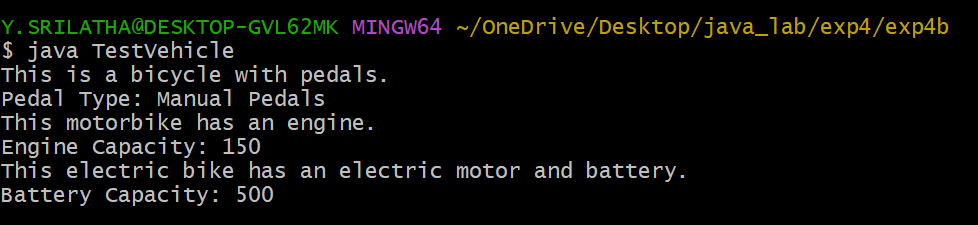
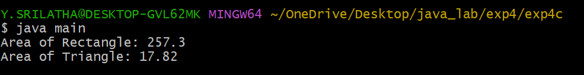

## EXPERIMENT-4:
# 4A) TITLE: TO IMPLEMENT SINGLE INHERITANCE .
# SOURCE CODE:
```java
class Person {
  String name;
  int age;
  Person(String name, int age) {
    this.name = name;
    this.age = age;
  }
  void displayPersonDetails() {
    System.out.println("Name: " + name);
    System.out.println("Age: " + age);
  }
}

class Employee extends Person {
  double annualSalary;
  int yearOfJoining;
  String nationalInsuranceNumber;
  Employee(String name, int age, double annualSalary, int yearOfJoining, String nationalInsuranceNumber) {
    super(name, age);
    this.annualSalary = annualSalary;
    this.yearOfJoining = yearOfJoining;
    this.nationalInsuranceNumber = nationalInsuranceNumber;
  }
  void displayEmployeeDetails() {
    displayPersonDetails();
    System.out.println("Annual Salary: " + annualSalary);
    System.out.println("Year of Joining: " + yearOfJoining);
    System.out.println("National Insurance Number: " + nationalInsuranceNumber);
  }
}
class TestEmployee {
  public static void main(String[] args) {
    Employee emp = new Employee("srilatha",38,100000.00,2007,"oct-27-2007");
    emp.displayEmployeeDetails();
  }
}
```
# OUTPUT:


# 4B) TITLE: TO IMPLEMENT MULTI-LEVEL INHERITANCE.
# SOURCE CODE:
```java
class Bicycle {
    String pedalType;
    void showBicycleInfo() {
        System.out.println("This is a bicycle with pedals.");
        System.out.println("Pedal Type: " + pedalType);
    }
}

class Motorbike extends Bicycle {
    int engineCapacity;
    void showMotorbikeInfo() {
        System.out.println("This motorbike has an engine.");
        System.out.println("Engine Capacity: " + engineCapacity);
    }
}

class ElectricBike extends Motorbike {
    int batteryCapacity;
    void showElectricBikeInfo() {
        System.out.println("This electric bike has an electric motor and battery.");
        System.out.println("Battery Capacity: " + batteryCapacity);
    }
}

class TestVehicle {
    public static void main(String[] args) {
        ElectricBike ebike = new ElectricBike();

        ebike.pedalType = "Manual Pedals";
        ebike.engineCapacity = 150;
        ebike.batteryCapacity = 500;

        ebike.showBicycleInfo();
        ebike.showMotorbikeInfo();
        ebike.showElectricBikeInfo();
    }
}

```
# OUTPUT:



# 4C) TITLE: CONSTRUCT ABSTRACT CLASS IN JAVA TO FIND AREAS OF DIFFERENT SHAPES.
# SOURCE CODE: 
```java
abstract class Figure {
  double dim1;
  double dim2;
  Figure(double dim1, double dim2) {
    this.dim1 = dim1;
    this.dim2 = dim2;
  }
  abstract double area();
}

class Rectangle extends Figure {
  Rectangle(double length, double breadth) {
    super(length, breadth);
  }
  double area() {
      double result = dim1 * dim2;
      return result;

  }
}

class Triangle extends Figure {
  Triangle(double base, double height) {
    super(base, height);
  }
  double area() {
      double result = 0.5 * dim1 * dim2;
      return result;

  }
}
class main {
  public static void main(String[] args) {
    Figure f1 = new Rectangle(15.5, 16.6);
    Figure f2 = new Triangle(6.6, 5.4);
    System.out.println("Area of Rectangle: " + f1.area());
    System.out.println("Area of Triangle: " + f2.area());
 }
}
```
# OUTPUT:

