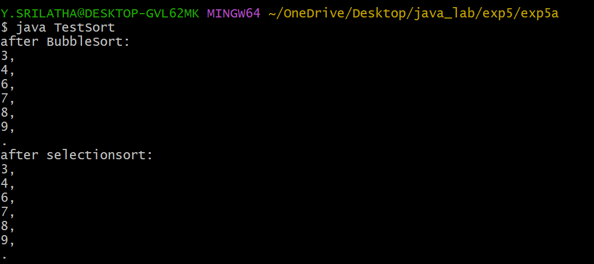

## EXPERIMENT-5A :
# TITLE : TO IMPLEMENT INTERFACE.
# SOURCE CODE :
```java
interface sortable {
  public abstract void sort(int[] arr);
}
class BubbleSort implements sortable {
  public void sort(int[] arr) {
    int size = arr.length;
    int temp = 0;
    for(int i=0; i<size-1; i++) {
      for(int j=0; j<size-i-1; j++) {
        if(arr[j] >arr[j+1]) {
          temp = arr[j+1];
          arr[j+1] = arr[j];
          arr[j] = temp;
        }
      }
    }
  }
}
class SelectionSort implements sortable {
  public void sort(int[] arr) {
    int size = arr.length;
    int minIndex = 0;
    int min;
    for(int i=0; i<size; i++) {
      min = arr[i];
      for(int j=i+1; j<size; j++) {
        if(min > arr[j]) {
          min = arr[j];
          minIndex = j;
        }
      }
      for(int j=minIndex; j>i; j--) {

        arr[j] = arr[j-1];
      }
      arr[i] = min;
    }
  }
}
class TestSort {
  static void display(int arr[]) {
    for(int ele : arr) {
      System.out.println(ele +", ");
    }
    System.out.println("\b\b.");
  }
  public static void main(String args[]) {
    int[] arr = {9, 7, 4, 3, 6, 8};
    int[] bar = {8, 6, 3, 4, 7, 9};
    sortable s;
    s = new BubbleSort();
    s.sort(arr);
    System.out.println("after BubbleSort: ");
    display(arr);
    s = new SelectionSort();
    s.sort(bar);
    System.out.println("after selectionsort: ");
    display(bar);
  }
}

# output :

