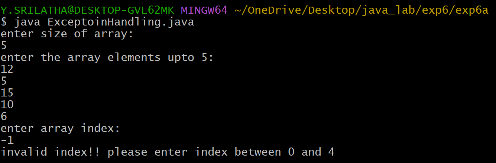

## EXPERIMENT-6A :
# TITLE : EXCEPTION HANDLING MECHANISM
# SOURCE CODE :
```java
import java.util.Scanner;
class ExceptionHandling {
  public static void main(String[] args) {
    Scanner sc = new Scanner(System.in);
    System.out.println("enter size of array: ");
    int size = sc.nextInt();
    int[] arr = new int[size];
    System.out.println("enter the array elements upto " + size + ":");
    for(int i=0; i<size; i++) {
      arr[i] = sc.nextInt();
    }
    int index;
    System.out.println("enter array index: ");
    index = sc.nextInt();
    try {
      System.out.println("element at array index is: " + arr[index]);
    }
    catch(ArrayIndexOutOfBoundsException e) {
      System.out.println("invalid index!! please enter index between 0 and " + (size-1));
    }
  }
```
# OUTPUT :

