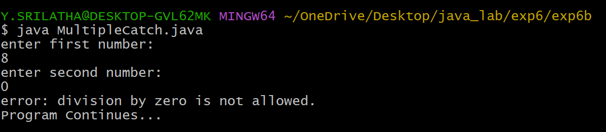
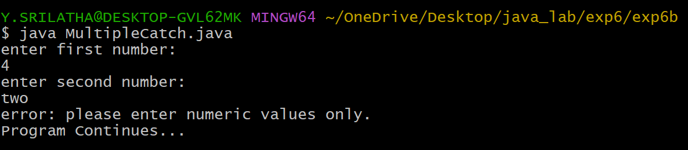
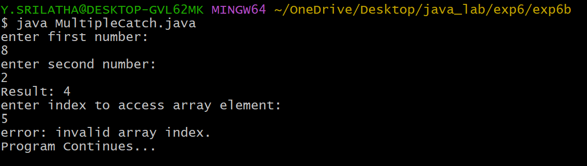
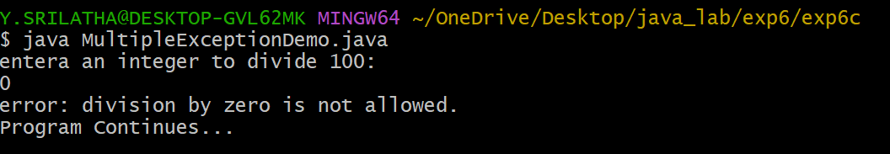
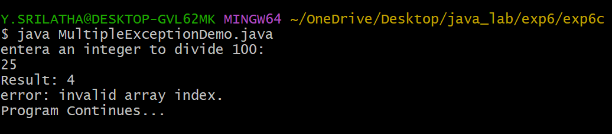
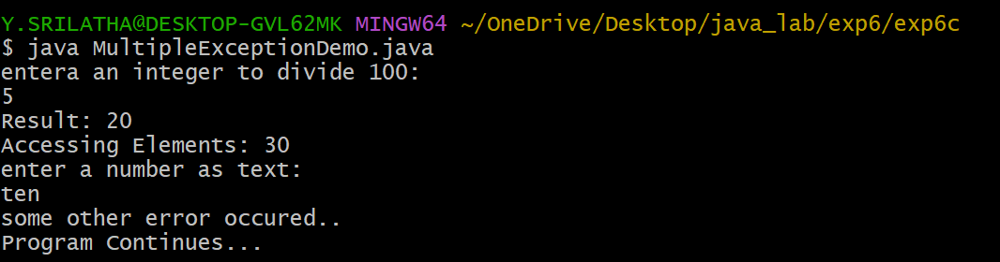

## EXPERIMENT-6A :
# TITLE : EXCEPTION HANDLING MECHANISM
# SOURCE CODE :
```java
import java.util.Scanner;
class ExceptionHandling {
  public static void main(String[] args) {
    Scanner sc = new Scanner(System.in);
    System.out.println("enter size of array: ");
    int size = sc.nextInt();
    int[] arr = new int[size];
    System.out.println("enter the array elements upto " + size + ":");
    for(int i=0; i<size; i++) {
      arr[i] = sc.nextInt();
    }
    int index;
    System.out.println("enter array index: ");
    index = sc.nextInt();
    try {
      System.out.println("element at array index is: " + arr[index]);
    }
    catch(ArrayIndexOutOfBoundsException e) {
      System.out.println("invalid index!! please enter index between 0 and " + (size-1));
    }
  }
```
# OUTPUT :


## EXPERIMENT-6B :
# TITLE : ILLUSTRATING MULTIPLE CATCH CLAUSES
# SOURCE CODE :
```java
import java.util.Scanner;
import java.util.InputMismatchException;
class MultipleCatch {
  public static void main(String[] args) {
    Scanner sc = new Scanner(System.in);
    int[] arr = {        };
    try {
      System.out.println("enter first number: ");
      int a = sc.nextInt();
      System.out.println("enter second number: ");
      int b = sc.nextInt();
      int result = a/b;
      System.out.println("Result: " + result);
      System.out.println("enter index to access array element: ");
      int index = sc.nextInt();
      System.out.println("element at index: " + (arr[index]));
    }
    catch(ArithmeticException e) {

      System.out.println("error: division by zero is not allowed.");
    }
    catch(InputMismatchException e) {
      System.out.println("error: please enter numeric values only.");
    }
    catch(ArrayIndexOutOfBoundsException e) {
      System.out.println("error: invalid array index.");
    }
    catch(Exception e) {
      System.out.println("some other error occured..");
    }
    System.out.println("Program Continues...");
  }
}
```
# OUTPUT :





## EXPERIMENT-6C :
# TITLE : CREATION OF JAVA BUILT-IN EXCEPTIONS
# SOURCE CODE :
```java
import java.util.Scanner;
import java.util.InputMismatchException;
class MultipleException {
  public static void main(String[] args) {
    Scanner sc = new Scanner(System.in);

    try {
      System.out.println("entera an integer to divide 100: ");
      int n = sc.nextInt();
      int result = 100/n;
      System.out.println("Result: " + result);
      int arr[] = {10, 20, 30};
      System.out.println("Accessing Elements: " + arr[2]);

      System.out.println("enter a number as text: ");
      sc.nextLine();
      String s = sc.nextLine();
      int num = Integer.parseInt(s);
      System.out.println("converted string number: ");

    }
    catch(ArithmeticException e) {

      System.out.println("error: division by zero is not allowed.");
    }
    catch(InputMismatchException e) {
      System.out.println("error: please enter numeric values only.");
    }
    catch(ArrayIndexOutOfBoundsException e) {
      System.out.println("error: invalid array index.");
    }
    catch(Exception e) {
      System.out.println("some other error occured..");
    }
    System.out.println("Program Continues...");
  }
}
```
# OUTPUT :




