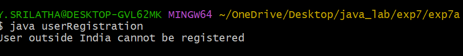
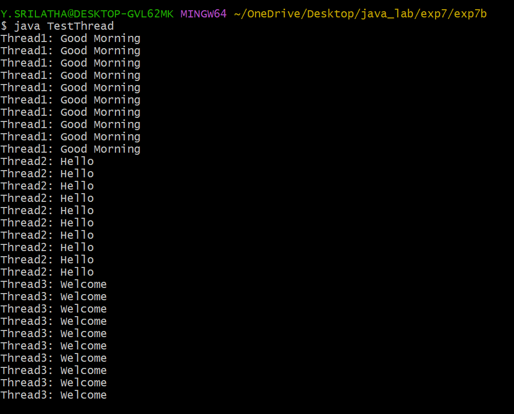

## EXPERIMENT-7A :
# TITLE : CREATION OF USER DEFINED EXCEPTION.
# SOURCE CODE :
```java
class InvalidCountryException extends Exception {
  InvalidCountryException() {
    super();
  }
  InvalidCountryException(String message) {
    super(message);
  }
}
class userRegistration {
  void registerUser(String userName, String userCountry) throws InvalidCountryException {
      if(!userCountry.equals("India")) {
        throw new InvalidCountryException("User outside India cannot be registered");
      }
      else {
        System.out.println("User Registration Done Successfully");
      }
    }

    public static void main(String[] args) {
      userRegistration ur = new userRegistration();
      try {
        ur.registerUser("srilatha ", "russia");

      }
      catch(InvalidCountryException e) {
        System.out.println(e.getMessage());
    }
  }
}
```
# OUTPUT :

## EXPERIMENT-7B :
# TITLE : CREATION OF THREADS BY EXTENDING THREAD CLASS.
# SOURCE CODE :
```java
class GoodMorningThread extends Thread {
  public void run() {
    for(int i=0; i<10; i++) {
      System.out.println("Thread1: Good Morning ");
    }
    try {
      Thread.sleep(1000);
    }
    catch(Exception e) {
      System.out.println("Exception : " + e);
    }

  }
}
class HelloThread extends Thread {
  public void run() {
    for(int i=0; i<10; i++) {
      System.out.println("Thread2: Hello ");
    }
    try {
      Thread.sleep(2000);
    }
    catch(Exception e) {
      System.out.println("Exception : " + e);
    }
  }
}
class WelcomeThread extends Thread {
  public void run() {
    for(int i=0; i<10; i++) {
      System.out.println("Thread3: Welcome");
    }
    try {
      Thread.sleep(3000);
    }
    catch(Exception e) {
      System.out.println("Exception : " + e);
    }
  }
}
class TestThread {
  public static void main(String[] agrs) {
    GoodMorningThread t1 = new GoodMorningThread();
    HelloThread t2 = new HelloThread();
    WelcomeThread t3 = new WelcomeThread();
    t1.start();
    t2.start();
    t3.start();
  }
}
```
# OUTPUT :



