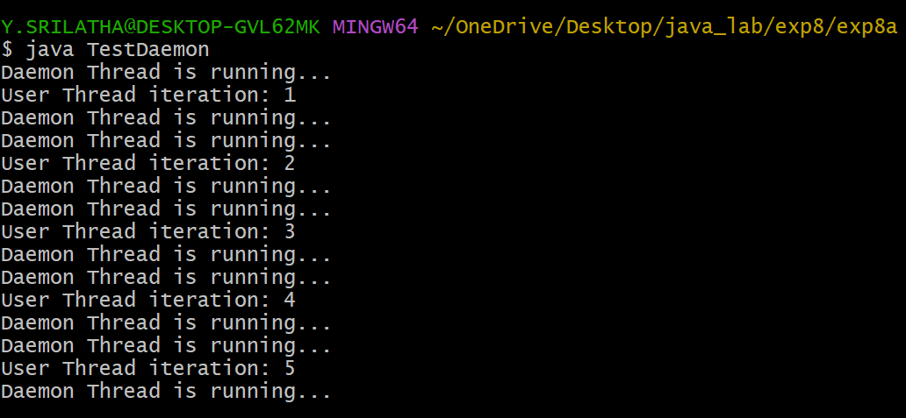
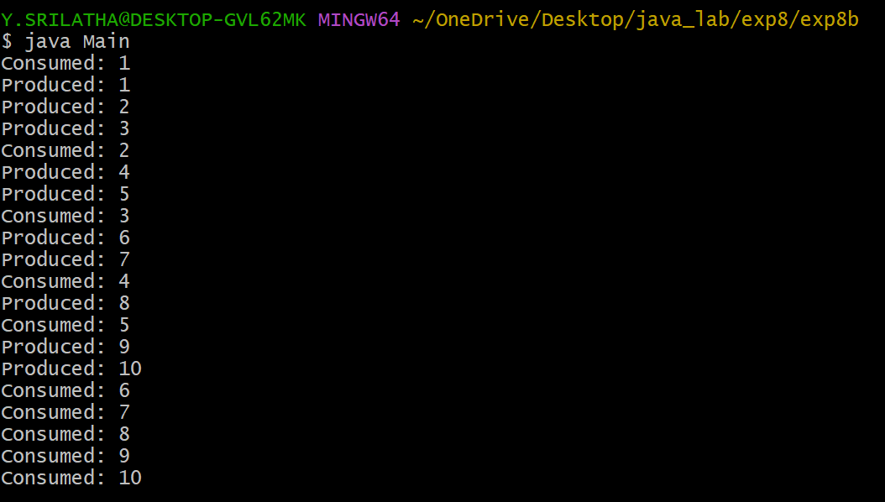

## EXPERIMENT-8A:
# TITLE: ILLUSTRATING DAEMON THREADS.
# SOURCE CODE:
```java
class UserThread extends Thread {
    public void run() {
        for (int i = 1; i <= 5; i++) {
            System.out.println("User Thread iteration: " + i);
            try {
                Thread.sleep(1000);
            } catch (InterruptedException e) {
                System.out.println("Exception occurred in UserThread");
            }
        }
    }
}

class DaemonThread extends Thread {
    public void run() {
        while (true) {
          System.out.println("Daemon Thread is running...");
          try{
              Thread.sleep(500);
            } catch (InterruptedException e) {
                System.out.println("Exception occurred in DaemonThread");
            }
        }
    }
  }
  class TestDaemon {
    public static void main(String[] args) {

        UserThread ut = new UserThread();
        DaemonThread dt = new DaemonThread();


        dt.setDaemon(true);
        ut.start();
        dt.start();


    }
}
```
# OUTPUT:


## EXPERIMENT-8B:
# TITLE: IMPLEMENT PRODUCER-CONSUMER PROBLEM USING INTER THREAD COMMUNICATION
# SOURCE CODE:
```java
class SharedBuffer {
    int[] buffer;
    int count = 0;
    int in = 0;
    int out = 0;

    SharedBuffer(int size) {
        buffer = new int[size];
    }


    synchronized void produce(int item) throws InterruptedException {
        while (count == buffer.length) {
            wait();
        }

        buffer[in] = item;
        in = (in + 1) % buffer.length;
        count++;

        notify();
    }


    synchronized int consume() throws InterruptedException {
        while (count == 0) {
            wait();
        }

        int item = buffer[out];
        out = (out + 1) % buffer.length;
        count--;

        notify();
        return item;
    }
}


class Producer extends Thread {
    private SharedBuffer buffer;

    Producer(SharedBuffer buffer) {
        this.buffer = buffer;
    }

    public void run() {
        try {
            for (int i = 1; i <= 10; i++) {
                buffer.produce(i);
                System.out.println("Produced: " + i);
                Thread.sleep(500);
            }
        } catch (InterruptedException e) {
            System.out.println("Producer interrupted");
        }
    }
}


class Consumer extends Thread {
    private SharedBuffer buffer;

    Consumer(SharedBuffer buffer) {
        this.buffer = buffer;
    }

    public void run() {
        try {
            for (int i = 1; i <= 10; i++) {
                int item = buffer.consume();
                System.out.println("Consumed: " + item);
                Thread.sleep(1000);
            }
        } catch (InterruptedException e) {
            System.out.println("Consumer interrupted");
        }
    }
}

class Main {
    public static void main(String[] args) {

        SharedBuffer buffer = new SharedBuffer(5);
//        SharedBuffer buffer = new int[5];
        Producer p = new Producer(buffer);
        Consumer c = new Consumer(buffer);

        p.start();
        c.start();
    }
}
```
# OUTPUT:



